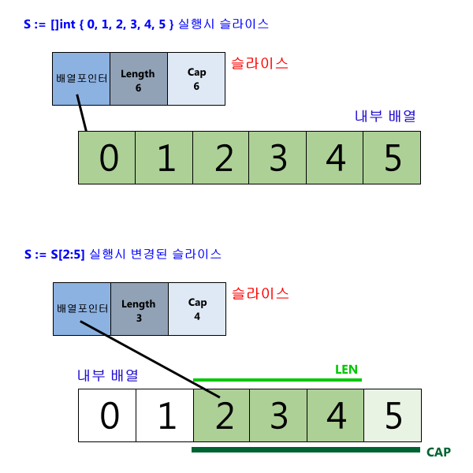

# Slice의 내부구조

- 슬라이스는 내부적으로 사용하는 배열의 부분 영역인 세그먼트에 대한 메타 정보를 가지고 있다. 슬라이스는 크게 3개의 필드로 구성되어 있는데, `첫째 필드는 내부적으로 사용하는 배열에 대한 포인터 정보`이고, `두번째는 세그먼트의 길이`를, 그리고 마지막으로 `세번째는 세그먼트의 최대 용량(Capacity)`이다.

- 처음 슬라이스가 생성될 때, `만약 길이와 용량이 지정되었다면, 내부적으로 용량(Capacity)만큼의 배열을 생성`하고, 슬라이스 첫번째 필드에 그 배열의 처음 메모리 위치를 지정한다. 그리고, `두번째 길이 필드는 지정된 (첫 배열요소로부터의) 길이를 갖게되고,` `세번째 용량 필드는 전체 배열의 크기를 갖는다.`

- 예를 들어, 아래 첫번 문장을 보면, 0부터 5까지 6개의 요소를 갖는 슬라이스를 생성하고 있음을 볼 수 있다. 이때, 슬라이스의 배열포인터는 내부 배열의 첫번째 요소인 0을 가리키고, 길이는 전체 6, 그리고 용량도 6으로 설정된다.

- 그런데, 만약 이 슬라이스 S 로부터 `Sub-slice S[2:5]`를 하게 되면 슬라이스의 내부데이타 어떻게 변경될까? `S[2:5]는 인덱스2부터 인덱스4까지의 배열요소를 가리키므로, 슬라이스 S의 배열포인터는 세번째 배열요소인 2를 가리키고, 길이는 3을, 그리고 용량은 세번째 배열요소부터 배열 마지막까지 즉 4를 갖게된다.`